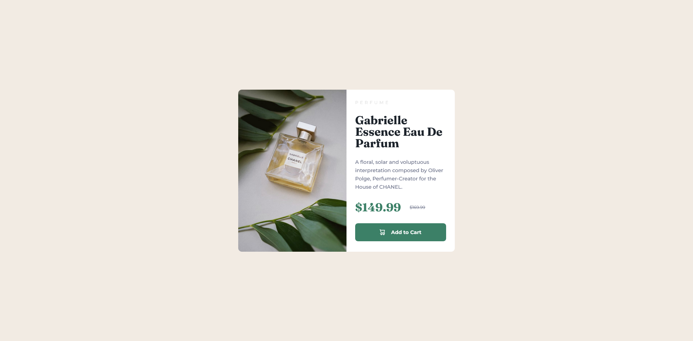

# Frontend Mentor - Product preview card component solution

This is a solution to the [Product preview card component challenge on Frontend Mentor](https://www.frontendmentor.io/challenges/product-preview-card-component-GO7UmttRfa). Frontend Mentor challenges help you improve your coding skills by building realistic projects.

## Table of contents

- [Overview](#overview)
  - [The challenge](#the-challenge)
  - [Screenshot](#screenshot)
  - [Links](#links)
- [My process](#my-process)
  - [Built with](#built-with)
  - [What I learned](#what-i-learned)
  - [Continued development](#continued-development)
- [Author](#author)

**Note: Delete this note and update the table of contents based on what sections you keep.**

## Overview

### The challenge

Users should be able to:

- View the optimal layout depending on their device's screen size
- See hover and focus states for interactive elements

### Screenshot

### Links

- Solution URL: [Frontend Mentor Solution Page](https://www.frontendmentor.io/solutions/product-preview-card-component-with-vanilla-html-and-css-cRK8gPfIaK)
- Live Site URL: [Github Pages](https://kamal-redzwan.github.io/07-frontendmaster-product-preview-card-component/)

## My process

### Built with

- Semantic HTML5 markup
- CSS custom properties
- Flexbox
- CSS Grid
- Mobile-first workflow

### What I learned

Changing the image with display:none on big breakpoint

### Continued development

Will work on the spacing for pixel perfection!

## Author

- Website - [Kamal Redzwan](https://www.kamalredzwan.com)
- Frontend Mentor - [@kmlrdzwn](https://www.frontendmentor.io/profile/kmlrdzwn)
- Twitter - [@kamalredzwan](https://www.twitter.com/kamalredzwan)
